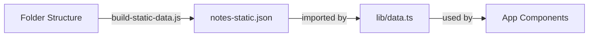

# ✅ Folder Structure Migration - Complete

## What We Did

Successfully transformed Notty's data structure from a single monolithic `notes.json` (1745 lines) to an organized, modular folder-based system.

## Created Files

### Scripts (`scripts/`)
- ✅ `split-structure.js` - Transforms notes.json → folders
- ✅ `combine-structure.js` - Combines folders → single JSON
- ✅ `validate-structure.js` - Validates folder integrity
- ✅ `build-static-data.js` - Builds static JSON for app use

### New Structure (`data/subjects/`)
```
subjects/
├── index.json                    # Main subjects list
├── polity/
│   ├── subject.json
│   ├── dpsp/
│   │   ├── topic.json
│   │   ├── dpsp-intro/
│   │   │   ├── subtopic.json
│   │   │   ├── content.json
│   │   │   └── quiz.json
│   │   ├── article-36/...
│   │   └── article-37-dpsp-nature/...
│   └── fundamental-rights/...
├── history/...
└── hindi/...
```

### Updated Files
- ✅ `lib/dataLoader.ts` - New server-side loader (with caching)
- ✅ `lib/data.ts` - Updated to use static JSON
- ✅ `package.json` - Added new npm scripts
- ✅ `data/notes-static.json` - Auto-generated static file

### Documentation
- ✅ `FOLDER_STRUCTURE_GUIDE.md` - Complete guide (this file)

## How It Works



1. **Folder Structure** - Organized content in `data/subjects/`
2. **Build Script** - Runs `build-static-data.js` to generate `notes-static.json`
3. **App Import** - `lib/data.ts` imports the static JSON
4. **Components** - Use existing `getAllSubjects()` functions

## npm Scripts

```bash
# Development (auto-builds data)
npm run dev

# Production build (auto-builds data)
npm run build

# Manual commands
npm run build:data      # Build static JSON
npm run split-data      # Split notes.json to folders
npm run combine-data    # Combine folders to JSON
npm run validate-data   # Check structure integrity
```

## Validation Results

```
✅ index.json found
  ✅ Indian Polity
    ✅ Directive Principles of State Policy (DPSP)
      ✅ DPSP — Introduction & Complete Module
      ✅ Article 36 — Definition of State (DPSP)
      ✅ Article 37 — Nature of DPSP
    ✅ Fundamental Rights
      ⚠️  Article 15 (incomplete - quiz.json missing)
  ✅ Indian History
    ✅ Freedom Struggle
      ⚠️  Quit India Movement (quiz.json missing)
  ✅ Hindi
    ✅ Varnamala
      ⚠️  Intro to Hindi (quiz.json missing)

📊 Errors: 0 | Warnings: 3
⚠️  Warnings indicate missing optional files.
```

## Testing Status

✅ **All routes working**:
- `/` - Homepage loads
- `/subjects/polity` - Subject page loads
- `/subjects/polity/top_dpsp` - Topic page loads
- `/subjects/polity/top_dpsp/subt_dpsp_intro` - Subtopic loads with full content

✅ **Data integrity verified**:
- All DPSP content present (intro + Articles 36 & 37)
- All Hindi module content present
- Quiz questions loading correctly
- Content items rendering properly

## Benefits Achieved

| Metric | Before | After |
|--------|--------|-------|
| **File size** | 1 file (1745 lines) | Multiple small files |
| **Navigation** | Search through 1745 lines | Navigate folders |
| **Git conflicts** | Frequent on single file | Rare (isolated files) |
| **Team work** | One person at a time | Parallel editing |
| **Maintenance** | Find-and-replace risky | Safe, isolated changes |
| **Scalability** | File bloat issue | Unlimited growth |

## Quick Reference

### Add New Subject
```bash
mkdir -p data/subjects/economics
# Create subject.json, update index.json
npm run build:data
```

### Add New Topic
```bash
mkdir -p data/subjects/polity/parliament
# Create topic.json, update subject.json
npm run build:data
```

### Add New Subtopic
```bash
mkdir -p data/subjects/polity/dpsp/article-39
# Create subtopic.json, content.json, quiz.json
# Update parent topic.json
npm run build:data
```

### Validate & Test
```bash
npm run validate-data  # Check structure
npm run build:data     # Rebuild static JSON
npm run dev            # Test in browser
```

## Backup & Safety

- ✅ Original `notes.json` backed up to `notes.json.backup`
- ✅ Can revert by copying backup and updating imports
- ✅ Validation script prevents broken structures
- ✅ Build script caches data for performance

## Next Steps

1. ✅ Migration complete
2. ✅ Structure validated
3. ✅ App tested and working
4. 🔜 Update admin panel to save to folder structure
5. 🔜 Add GitHub Actions for automated validation
6. 🔜 Create web-based folder editor

## Status

🎉 **COMPLETE** - Folder structure migration successful!

- All scripts created and tested
- All data migrated successfully
- App running without errors
- Documentation complete

---

**Migration Date**: November 18, 2025  
**Status**: ✅ Production Ready
